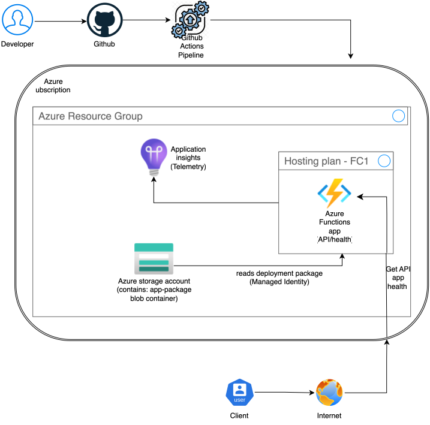

## Architecture Diagram




## Design

The task asked for a simple health-check API on Azure, using an Azure Function App, a Storage Account and Application Insights, deployed with Bicep and no manual steps in the portal, delivered through a pipeline.

The app itself is a single Node.js function that returns a health status. Nothing complicated there.

For the infrastructure, I split the deployment into reusable Bicep modules — storage, Application Insights, hosting plan, managed identity, Key Vault, alerts, and the Function App itself — composed from a single `main.bicep`. I originally planned to use the standard Consumption plan (Y1), but hit a quota limit of zero on the free trial subscription, so I switched to the newer Flex Consumption plan (FC1) instead. This plan needs the Function App to use a Managed Identity to read its own deployment files from storage, rather than a stored key, which happened to satisfy the optional Managed Identity requirement as a side effect.

I also added a Key Vault and a metric alert as two more of the optional stretch goals. The Key Vault stores the storage account key as a secret, with RBAC-only access granted solely to the Function App's managed identity. The app doesn't actually read this secret at runtime, since its storage connection is already fully identity-based and needs no key at all, which is the stronger pattern, so the vault sits alongside it as a defense-in-depth measure rather than something actively used. The alert watches the Function App's execution count and fires if it goes silent for 15 minutes; Flex Consumption doesn't expose an HTTP error-rate metric the way classic App Service does, so this catches total silence rather than active failures, and it currently has no action group wired up, so it fires without notifying anyone yet. Both of these gaps are listed below under improvements.

For CI/CD I used GitHub Actions rather than Azure DevOps Pipelines. This matches my existing experience running similar pipelines against AWS, using the same secure login method (OIDC) with no stored passwords or secrets. I've also included a reference Azure DevOps pipeline (azure-pipelines.yml) for comparison, though it isn't connected to a live project.

The trickiest problem I ran into wasn't in the initial build, it showed up when I tore down individual resources for testing while deliberately keeping the resource group itself intact, to avoid having to redo the pipeline's permissions setup. My role assignment for the storage identity used a deterministic name, generated from the storage account and identity's resource IDs. That's normally good practice, it makes redeploys idempotent, but it meant that when I deleted and recreated the storage account and identity, the old role assignment stuck around as an orphan under that same name, and the new deployment collided with it. I tracked it down by comparing role assignment lists before and after, removed the orphaned one manually, then fixed the underlying cause by including a deployment timestamp in the naming formula, so each deployment now generates a fresh, unique name instead of risking a collision again.

## How to deploy          

### Prerequisites         

- Azure CLI installed     
- Node.js 20+

### 1. Check if the resource group exists

```bash
az group show --name rg-health-api-dev
```

If it doesn't exist yet, create it:

```bash
az group create --name rg-health-api-dev --location eastus
```

### 2. One-off setup: give the pipeline permission to deploy

This only needs doing once per resource group. It's the classic chicken and egg problem: GitHub Actions authenticates fine via OIDC, but without the right role assignment on the resource group, it still can't actually deploy anything.

There are two ways round having to repeat this. One is to keep the resource group itself out of the teardown process entirely, so it's never deleted along with the rest of the infrastructure, since role assignments live at the resource group level and survive as long as it does. The other is adding a bootstrap step to the pipeline that creates the resource group before deploying main.bicep. Either way, something still needs permission to carry out that first step, so it can't fully remove the manual part, only move it.

### 3. Deploy
Push to `main`. The pipeline will:
1. Install dependencies
2. Log in to Azure via OIDC
3. Deploy the infrastructure (Bicep)
4. Deploy the function code

### Deploying manually, without the pipeline
```bash
az deployment group create --resource-group rg-health-api-dev --template-file infra/main.bicep
func azure functionapp publish <function-app-name>
```

### Running it locally
```bash
npm install
func start
curl http://localhost:7071/api/health
```

## Assumptions

## Assumptions

- I deployed to `eastus` rather than `uksouth`, because the free trial subscription had a Y1 quota of zero in every UK/EU region I tried.
- I used FC1 instead of the classic Y1 Consumption plan, for the same reason.
- The deployment package and the runtime storage connection both use Managed Identity rather than a key, since FC1 requires identity-based access for deployment and I extended the same approach to the runtime connection.
- The Key Vault holds a copy of the storage key as a defense-in-depth measure, but the app doesn't read from it, since the storage connection doesn't need a key at all.
- The metric alert has no action group attached, so it fires without notifying anyone yet.
- I scoped the pipeline's identity to Contributor and User Access Administrator on the resource group only, not the subscription, to keep the blast radius small.
- I set the `/api/health` endpoint to anonymous auth rather than a function key, since it's a public health check with nothing sensitive in it.
- I made the repository public, following the brief's stated preference.

## What I'd Improve With More Time

- Wire the Function App's storage connection to actually resolve the key via a Key Vault reference, so the vault is exercised end-to-end rather than just holding a secret in reserve.
- Add an action group to the metric alert so it actually notifies someone, and add a couple more alerts, such as HTTP error rate.
- Separate staging and production environments, parameterized through Bicep and pipeline stages, instead of the one flat `dev` environment I have now.
- Add VNet integration and private networking instead of a public endpoint.
- Raise the storage account's minimum TLS version from its default of 1.0 to 1.2.
- Move off `Standard_LRS` to a redundancy tier appropriate for real data.
- Upgrade the Function App runtime from Node 20 to Node 24, the current LTS.
- Add automated tests: a unit test for the function itself, and a post-deploy smoke test in the pipeline that hits `/api/health` and checks the response.
- Automate the pipeline's own bootstrap step, or at least document it as a clearer setup script rather than manual CLI commands.
- Connect the Azure DevOps pipeline to a real project rather than leaving it as a reference file.
- Handle Key Vault's soft-delete behaviour explicitly in any teardown process; deleting the vault without also purging it would block a fresh vault of the same name being recreated.

## Trade-offs

- **Deterministic vs unique role assignment naming.** My storage role assignment was originally named deterministically, from the storage account and identity's resource IDs. That's correct for normal redeploys, since Azure recognises the same assignment already exists and does nothing, but it meant that when I deleted the storage account and identity individually while keeping the resource group intact, the old assignment stuck around as an orphan and blocked recreation under the same name. I tried fixing this by making the name unique per deployment using a timestamp, but that broke the far more common case: a normal redeploy where nothing had changed then tried to create a second, functionally duplicate role assignment, which Azure also blocks, just with a different error. I reverted to deterministic naming, since it's correct for day-to-day use, and left the teardown-collision scenario as a known limitation instead, documented below.
- **Key Vault holding a key the app doesn't use.** The Function App's storage connection is fully identity-based and needs no key at all, so the Key Vault secret isn't read at runtime. I kept it anyway as a defense-in-depth measure rather than removing it, on the basis that having the key available somewhere secured is safer than not having it stored anywhere, even if nothing currently depends on it.
- **FC1 over Y1.** Not a preference, a workaround for a quota limit of zero on the free trial subscription. Y1 would have kept the Function App resource simpler, without needing a Managed Identity or the blob-based deployment storage FC1 requires.